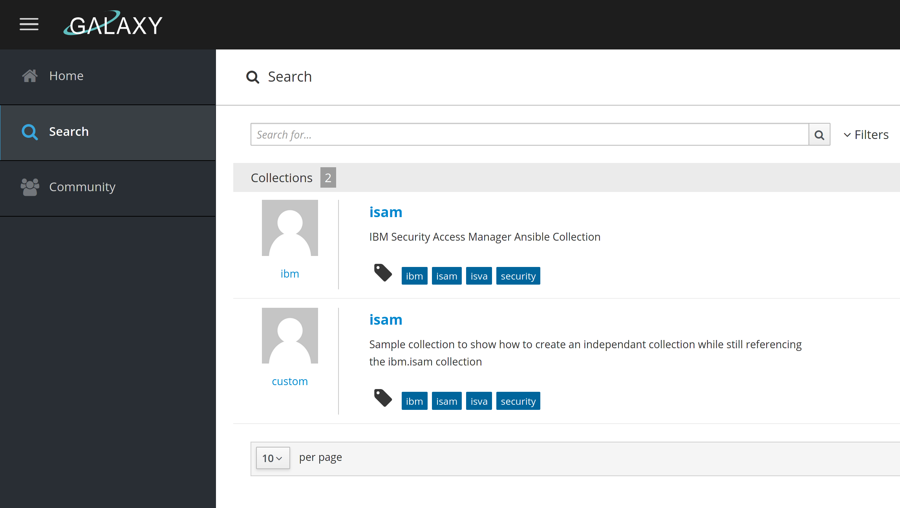

# Install AWX

## Docker

I've followed the instruction here https://github.com/ansible/awx/blob/devel/INSTALL.md#docker-compose

The only important thing is that you must prepare the virtual environment directory.
> # AWX custom virtual environment folder. Only usable for local install.
> custom_venv_dir=/data/venv/

I hope this allows you to prepare the virtual environment to run Ansible in, on your machine.
The AWX installation that runs in Docker should then pick it up.


# Start stop the awx
The docker compose result ends up here:

cd ~/.awx/awxcompose/

In that directory, you can run the "docker-compose" commands.
docker-compose logs


# Collections

There's problems with installing collections on AWX/Tower using requirements.yml at least for me , on version 17.0.1 with Ansible 2.9.17.

```
"stderr_lines": [
    "ERROR! Invalid collection name 'git@github.com:tombosmansibm/custom_isam_collection.git', name must be in the format <namespace>.<collection>. Please make sure namespace and collection name contains characters from [a-zA-Z0-9_] only."
```

While it works fine on Ansible 2.10+ to use the git url as "name", it does not on AWX/Tower.

So I followed instructions here to create a local galaxy server:
https://galaxy.ansible.com/docs/developers/contributing.html#setting-up-your-development-environment

This results in a local galaxy server running on port 8000: http://localhost:8000/

## Prepare your ansible-galaxy client
Create an ansible.cfg file , for instance in your home directory (touch ~/.ansible.cfg)
This can contain multiple Galaxy servers, and the servers are picked in order of precedence here.
So by setting local_galaxy as first entry, it will make sure your local galaxy server is used.
If you want to use a different server, you must use the "--server" parameter.

> [galaxy]
> server_list = local_galaxy, release_galaxy
> 
> [galaxy_server.release_galaxy]
> url=https://galaxy.ansible.com/
> 
> [galaxy_server.local_galaxy]
> url=http://localhost:8000/
> token=<token>

## Add namespace
To be able to publish on the public Galaxy server, you need to request a namespace first.

On the local machine, you can obviously create it yourself.

As the administrator user, create a namespace here:
http://localhost:8000/admin/main/namespace/

In this demo, I need to add the namespace "custom".  Note that each user has a namespace automatically created already (matches his Github username).
You also need the ibm namespace, to be able to import the ibm.isam collection.

```
custom
ibm
```

To avoid this error, we need to also import the ibm.isam collection on the local Galaxy server.
> ERROR! Galaxy import process failed: Invalid collection metadata. Dependency namespace not in galaxy: ibm.isam (Code: GLW0002)

Download the collection tarball from https://galaxy.ansible.com/ibm/isam and publish it:

> [tbosmans@tbosmans-p73 isam]$ ansible-galaxy collection publish /home/tbosmans/Downloads/ansible/ibm-isam-1.0.0.tar.gz 
> Publishing collection artifact '/home/tbosmans/Downloads/ansible/ibm-isam-1.0.0.tar.gz' to local_galaxy http://localhost:8000/api
> Collection has been published to the Galaxy server local_galaxy http://localhost:8000/api
> Waiting until Galaxy import task http://localhost:8000/api/v2/collection-imports/6/ has completed
> Collection has been successfully published and imported to the Galaxy server local_galaxy http://localhost:8000/api

## Publish custom collection

````
ansible-galaxy collection publish /home/tbosmans/ansible/ansible_collections/custom/isam/custom-isam-1.0.15.tar.gz
````

You need to end up with this:
> Collection has been successfully published and imported to the Galaxy server local_galaxy http://localhost:8000/api

## Galaxy interface
The result should be that you can locate the 2 collections on your local Galaxy server.




# Install

Now you cannot use "localhost:8000" from within the local AWX container, because that will not resolve.
To make this work, you need to put a local ip address in there

  - name: custom.isam
    source: 'http://<local ip address>:8000'